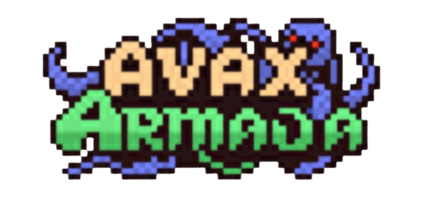

<div align="center">
  
  
  # 🏴‍☠️ AVAX Armada
  
  **A Fully On-Chain Naval Strategy Game on Avalanche**
  
  *Command your ship, explore the seas, engage in epic battles, and rise through the ranks in this immersive blockchain-powered maritime adventure!*
</div>

---

## 🌊 Overview

AVAX Armada is a fully on-chain strategy game where players become naval commanders, choosing between the disciplined Navy or the rebellious Pirates. Battle for supremacy, upgrade your ships, explore vast oceans, and claim your place in maritime history—all powered by smart contracts on Avalanche.

### ✨ Key Features

- **🏴‍☠️ Choose Your Faction**: Join the Navy or become a Pirate
- **⚔️ Naval Combat**: Strategic battles with damage calculations
- **🚢 Ship Upgrades**: Enhance attack, defense, speed, and crew capacity  
- **🗺️ Ocean Exploration**: Travel between locations with realistic timing
- **💰 Economic System**: Gold Per Minute (GPM), daily check-ins, and crew management
- **🔧 Repair System**: Multiple repair options with different costs and timing
- **💎 Diamond Economy**: Premium currency with revenue sharing
- **🏆 Ranking System**: Compete for the top leaderboard positions
- **🛡️ Safe Ports**: Protected areas for repairs and crew hiring

---

## 🛠️ Technology Stack

### 🎯 Frontend Technologies

- **[Next.js 15.3.2](https://nextjs.org/)** - React framework with App Router
- **[React 19](https://reactjs.org/)** - Latest React with concurrent features
- **[TypeScript](https://www.typescriptlang.org/)** - Type-safe development
- **[Tailwind CSS 4.0](https://tailwindcss.com/)** - Utility-first CSS framework
- **[Framer Motion](https://www.framer.com/motion/)** - Smooth animations and transitions
- **[PixiJS](https://pixijs.com/)** - High-performance 2D rendering for game graphics
- **[Sonner](https://sonner.emilkowal.ski/)** - Beautiful toast notifications

### ⛓️ Blockchain & Web3

- **[Thirdweb SDK v5](https://thirdweb.com/)** - Complete Web3 development platform
- **[Viem](https://viem.sh/)** - Type-safe Ethereum client
- **[Solidity ^0.8.17](https://soliditylang.org/)** - Smart contract development
- **[OpenZeppelin](https://openzeppelin.com/)** - Security-audited contract libraries
- **[Avalanche](https://www.avax.network/)** - Avalanche for low fees and fast transactions

### 🔧 Development Tools

- **[Hardhat](https://hardhat.org/)** - Ethereum development environment
- **[TypeChain](https://github.com/dethcrypto/TypeChain)** - TypeScript bindings for contracts
- **[ESLint](https://eslint.org/)** - Code linting and formatting
- **[Jest](https://jestjs.io/)** - Testing framework

### 💳 Wallet Integration

- **MetaMask** - Browser extension wallet
- **Thirdweb In-App Wallet** - Social login with:
  - Google, Discord, Telegram

---

## 🎮 Game Mechanics

### 🏗️ Account Creation
- Choose your ship name (up to 12 characters)
- Select faction: Navy ⚓ or Pirates 🏴‍☠️
- Pick starting location (0-100 on the map)
- Begin with basic stats and 100 gold

### ⚔️ Combat System
- **Strategic Battles**: Attack = damage dealt, Defense = damage reduced
- **Ship Destruction**: Ships with 0 HP are wrecked and teleported to nearest port
- **Safe Zones**: Ports (locations 25, 55, 89) are attack-free areas
- **Loot System**: Winners steal gold based on crew size

### 🚢 Ship Management
- **Upgrades**: Exponential pricing system (1.5x multiplier per purchase)
- **Crew Hiring**: Hire crew at ports (10 gold per crew member)
- **Repair Options**:
  - **Free**: 30 minutes per 25 maxHP, 50% crew recovery
  - **Gold**: 5 minutes per 25 maxHP, full crew recovery  
  - **Diamond**: Instant repair, full crew recovery

### 💰 Economic Features
- **Daily Check-ins**: Earn gold based on crew size and streak bonus
- **Gold Per Minute (GPM)**: Passive income from upgrades
- **Diamond Purchases**: Premium currency with AVAX
- **Revenue Sharing**: Top 3 players receive diamond purchase rewards

### 🗺️ Travel & Exploration
- **Distance-based Travel**: Time calculated by location difference
- **Speed Bonuses**: Upgrades reduce travel time
- **Fast Travel**: Instant travel using diamonds
- **Strategic Positioning**: Location affects combat opportunities

---

## 🚀 Getting Started

### Prerequisites

- Node.js 18+ and pnpm
- MetaMask or compatible Web3 wallet
- Some AVAX for transactions on Avalanche

### Installation

```bash
# Clone the repository
git clone https://github.com/Kaustubh-404/hackathon-game-AVAX
cd hackathon-game-AVAX

# Install dependencies
pnpm install

# Set up environment variables
cp .env.example .env.local
# Add your Thirdweb client ID and other config
```

### Development

```bash
# Start the development server
pnpm dev

# Compile smart contracts
pnpm compile

# Generate TypeScript types
pnpm generate-types
```

### Deployment

```bash
# Deploy to testnet
pnpm deploy:testnet

# Deploy to mainnet
pnpm deploy:mainnet

# Verify contracts
pnpm verify:mainnet
```

---

## 🏗️ Smart Contract Architecture

The game is powered by the `AvaxArmada.sol` contract featuring:

### Core Structures
- **Account**: Player state (gold, diamonds, HP, stats, location)
- **Upgrade**: Ship enhancement definitions with bonuses
- **Purchase Tracking**: Exponential pricing per player

### Key Functions
- `createAccount()` - Ship registration
- `buyUpgrade()` - Ship improvements with auto-GPM claiming
- `attack()` - Combat between different factions
- `travel()` - Movement with optional fast travel
- `repairShip()` - Multiple repair options
- `checkIn()` - Daily rewards system
- `claimGPM()` - Passive income collection

### Security Features
- OpenZeppelin's `Ownable` and `ReentrancyGuard`
- Input validation and bounds checking
- Time-based action protection
- Faction-based combat restrictions

---

## 💎 Diamond Economy

| Package | Cost | Diamonds | Value |
|---------|------|----------|-------|
| Starter | 10 AVAX | 1 💎 | Fast travel, instant repairs |
| Adventurer | 45 AVAX | 5 💎 | 10% discount per diamond |
| Captain | 90 AVAX | 10 💎 | 12.5% discount per diamond |

**Revenue Distribution:**
- 40% → #1 Ranked Player
- 20% → #2 Ranked Player  
- 10% → #3 Ranked Player
- 30% → Contract Treasury

---

## 🏆 Ranking System

Players are ranked by **Total Combat Power** (Attack + Defense + Speed).

**Leaderboard Benefits:**
- Revenue sharing from diamond purchases
- Prestige and recognition
- Strategic advantage in faction wars

---

## 🔐 Security & Testing

```bash
# Run comprehensive test suite
pnpm test:all

# Gas optimization analysis
pnpm test:gas

# Integration testing
pnpm test:integration

# Test coverage report
pnpm test:coverage
```

**Security Measures:**
- Reentrancy protection on all state-changing functions
- Input validation and sanitization
- Time-based action cooldowns
- Owner-only administrative functions

---

<div align="center">
  <p><strong>⚓ Set sail and conquer the AVAX Armada! ⚓</strong></p>
  <p><em>May the winds be at your back and your cannons ever true.</em></p>
</div>
